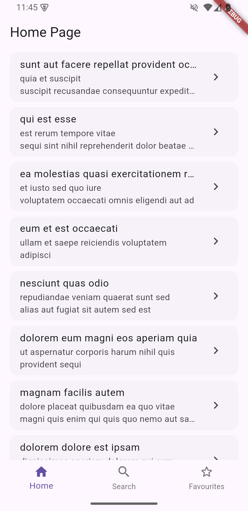
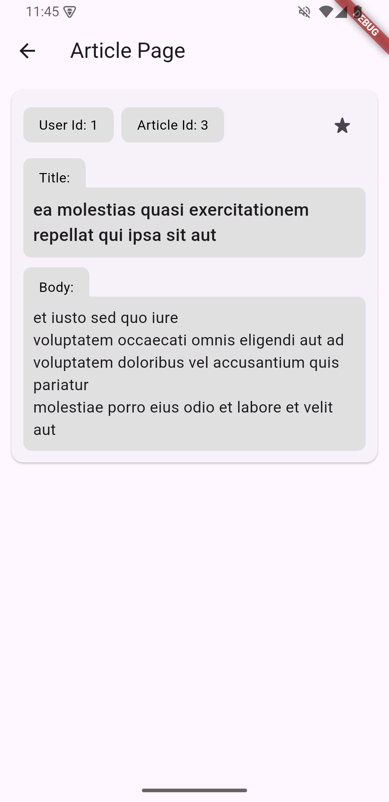
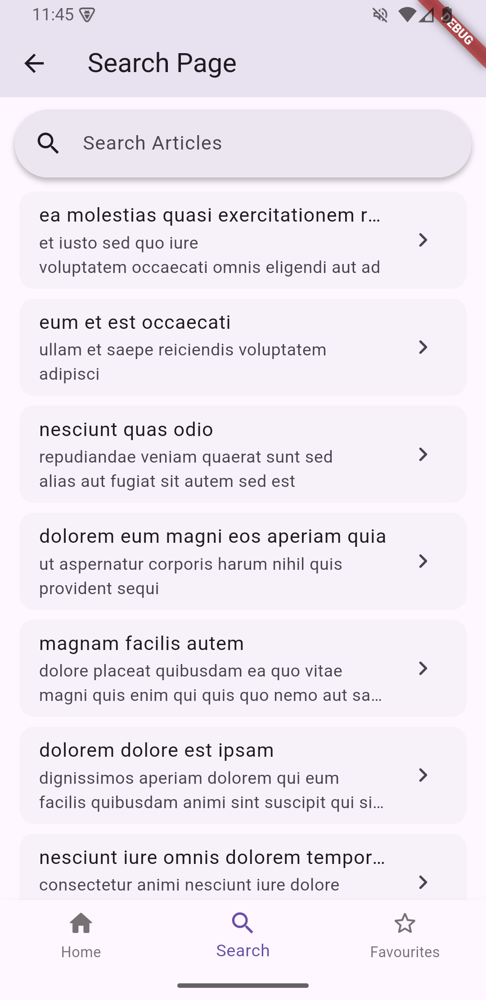
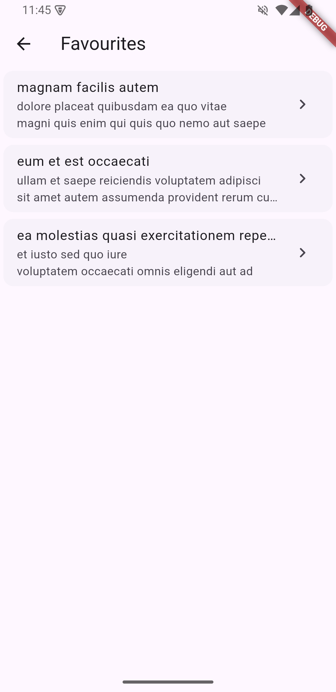

# 📚 Flutter Article App

A Flutter app that fetches and displays a list of articles from a public API, providing a seamless and responsive experience with essential features like search, article details and Favourites.

---

## 🚀 Features

- 📄 **List of Articles:** Browse articles fetched from a public API.
- 🔍 **Search Functionality:** Quickly find articles using keywords.
- 📑 **Detail View:** View full article content with additional metadata.
- 📑 **Favourite View:** Browse articles Marked as favourites.

---

## 🛠️ Setup Instructions

1. **Clone the repository:**

   ```bash
   git clone https://github.com/kaushalzod/clean_article_app.git
   cd clean_article_app
   ```

2. **Install dependencies:**

   ```bash
   flutter pub get
   ```

3. **Run the app:**

   ```bash
   flutter run
   ```

---

## 💻 Tech Stack

- **Flutter SDK:** 3.29+
- **State Management:** Provider
- **HTTP Client:** dio
- **Persistence:** shared_preferences

---

## 📐 State Management Explanation

The app uses **Provider** for state management, providing a simple yet powerful approach to handle the state of articles, search queries, article details and favourites. This approach ensures a clear separation of concerns, promoting scalability and testability.

---

## ⚠️ Known Issues / Limitations

- ❗ Initial loading can be optimized with caching.
- ❗ Testcases to be written for entire project

---

## 📸 Screenshots (Optional)

### Home Screen | Article Detail

<p align="center">
  
  
</p>

### Search Screen | Favourite Screen

<p align="center">
  
  
</p>

## 🌱 Future Improvements

- Add offline support for reading articles.
- Improve UI design for better user Experience
- Implement pagination for larger article lists.
